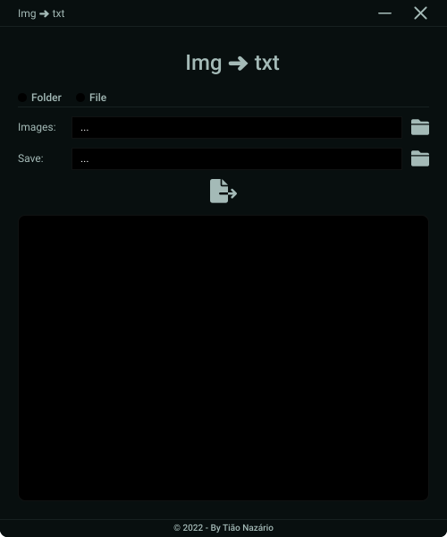

<h1 align="center">:file_cabinet: Img ➜ txt</h1>

## :memo: Description

System created to convert image texts into txt files

## :books: Functionalities

* <b>Folder</b>: Convert all images in a folder to txt.
* <b>File</b>: Convert a specific image to txt.

### 🖥 Design



## 👨‍💻 Technologies used

<a href="https://www.python.org">
  
  <span>Python</span>
</a>
 
 ## :rocket: Running the project
 
 To run the project, it is necessary to follow the next steps.
  
 ### Step 1 - Clone the repository

```git
git clone https://github.com/tiaonazario/img-txt.git
```
 
 ### Step 2 - Install the packages

```powershell
pip install pytesseract
pip install opencv-python
pip install PySide6
```

### Step 3 - Install pytesseract exe

1. Download tesseract exe [here](https://github.com/UB-Mannheim/tesseract/wiki)

2. Install this exe in C:\Program Files (x86)\Tesseract- OCR

3. Install the desired [language](https://github.com/tesseract-ocr/tessdata)

## :handshake: Collaborators

<table>
  <tr>
    <td align="center">
      <a href="http://github.com/tiaonazario">
        <br>
        <sub>
          <b>tiaonazario</b>
        </sub>
      </a>
    </td>
  </tr>
</table>

## :dart: Project status

Ready, but upgradable
